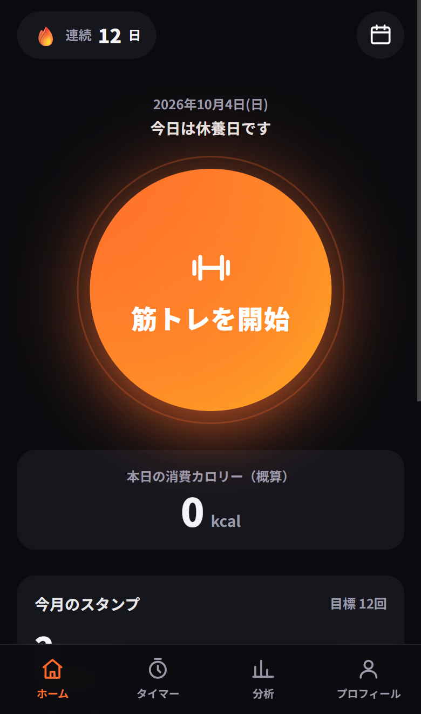
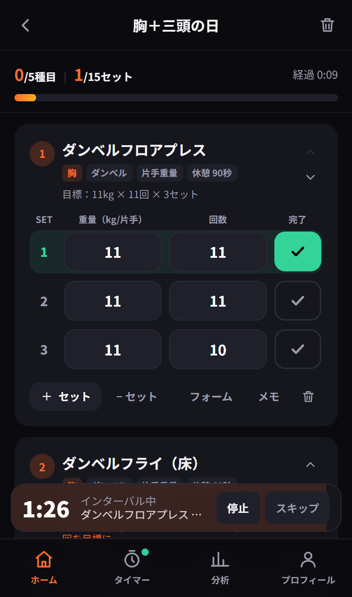
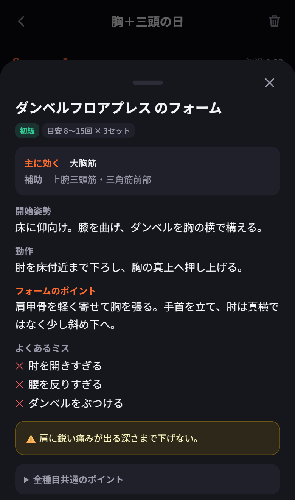
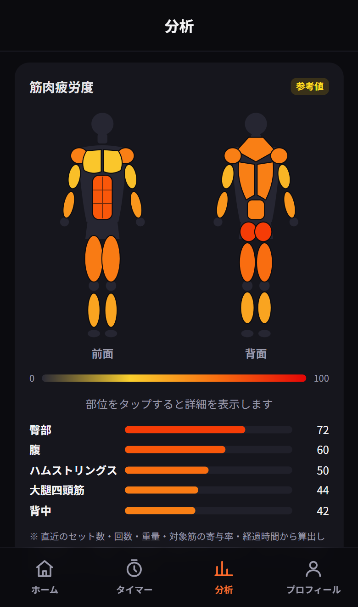
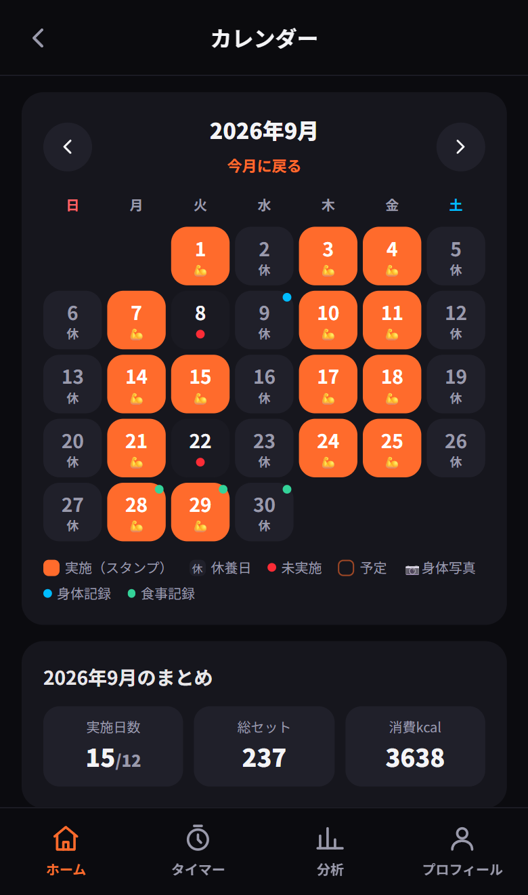

# 筋トレ管理アプリ（スマホ向け PWA）

自宅でダンベル・自重トレーニングを続けるための記録アプリです。
「記録する・続ける・振り返る」を 1 つのアプリで完結させることを目標に、要件定義から設計・実装・デプロイまで個人で行いました。

<table>
  <tr>
    <td></td>
    <td></td>
    <td></td>
    <td></td>
    <td></td>
  </tr>
  <tr>
    <td align="center">ホーム</td>
    <td align="center">記録＋自動インターバル</td>
    <td align="center">種目ごとのフォーム解説</td>
    <td align="center">筋肉疲労度マップ</td>
    <td align="center">スタンプカレンダー</td>
  </tr>
</table>

## 主な機能

- **トレーニング記録**：テンプレートから開始し、前回の重量・回数を引き継いで入力。セット完了でインターバルタイマーが自動で始まる
- **36 種目の標準メニューとフォーム解説**：開始姿勢・動作・ポイント・よくあるミス・注意点を種目ごとに表示。自分で追加した種目には効く筋肉（メイン／サブ）とフォーム解説を自由に設定できる
- **インターバルタイマー**：別画面に移っても継続し、終了時に音・振動・通知
- **続ける仕組み**：曜日スケジュール、カレンダー、スタンプ、連続記録（ストリーク）、バッジ、自己ベスト（推定 1RM）更新の通知
- **振り返り**：筋肉疲労度マップ（対象筋の寄与率と経過時間から推定）、月間集計、前月比、AI 月次レポート
- **身体記録**：体重・BMI・体脂肪率・筋肉量・ウエストと 3 方向の写真。写真は並べて比較・スライダー・タイムラプスで比較できる
- **食事・カロリー**：PFC の記録、食品検索（内蔵リスト＋Open Food Facts）、バーコード入力、摂取と消費の収支
- **クラウド同期とプッシュ通知**：ログインすると複数端末で同期。アプリを閉じていても予定・記録忘れ・インターバル終了を通知
- **データの持ち出し**：JSON バックアップと復元、CSV 書き出し

## 技術スタック

| 分類 | 使用技術 |
| --- | --- |
| フロントエンド | Next.js 16（App Router）/ React 19 / TypeScript / Tailwind CSS v4 |
| 状態管理・保存 | Zustand（localStorage に永続化）/ IndexedDB（写真） |
| バックエンド | Next.js Route Handlers / Supabase（Auth・Postgres・Storage） |
| 通知 | Web Push（VAPID）/ Service Worker / pg_cron |
| グラフ | Recharts |
| ホスティング | Vercel + Supabase |

## 設計で工夫した点

- **ローカルファースト同期**：すべての操作はまず端末に保存し、オンライン復帰時・アプリ復帰時・60 秒ごとに差分だけを Supabase と送受信する。オフラインのジムでも記録が止まらない。初回ログイン時に端末とクラウドの両方にデータがある場合は、どちらを使うかを選べる（[`src/lib/sync.ts`](src/lib/sync.ts)）
- **データの保護**：全テーブルに RLS（本人の行のみ読み書き可）を設定。身体写真は非公開バケットに `<user_id>/` 単位で保存（[`supabase/migrations`](supabase/migrations)）
- **サーバーレスでの正確な通知**：5 分以内のインターバル通知は `after()` でレスポンス後に待機して送信し、それ以降の予約通知と日次通知は pg_cron から毎分 cron API を叩いて処理する。常駐サーバーで動かす場合は内蔵スケジューラに切り替わる（[`src/lib/server/push.ts`](src/lib/server/push.ts)）
- **SSRF 対策**：プッシュ通知の送信先は主要ブラウザのプッシュサービスのドメインに限定（[`src/app/api/push/_shared.ts`](src/app/api/push/_shared.ts)）
- **AI に渡すデータを最小化**：月間の集計値だけを、許可した項目に絞り込んでから外部 API に送る。写真・メモ・ニックネームは送らない。未設定やエラーの場合は定型レポートに切り替わる（[`src/app/api/ai/report/route.ts`](src/app/api/ai/report/route.ts)）
- **本人専用モード**：環境変数で「ログイン必須・新規登録なし・許可したメールアドレス以外の API 利用を拒否」に切り替えられる。コードは公開したまま、本番は自分だけで使える（[`src/lib/server/auth.ts`](src/lib/server/auth.ts)）
- **外部サービスはすべて任意**：何も設定しなければ端末内だけで完結して動く

## ディレクトリ構成

```
src/
  app/            画面（ホーム・トレーニング・タイマー・分析・カレンダー・食事・プロフィール・設定）と API
    api/          AI レポート / 食品検索 / Web Push（購読・予約・cron）
  components/     UI 部品、筋肉マップ、フォーム解説、同期・通知の常駐コンポーネント
  lib/            状態管理、同期エンジン、計算（カロリー・疲労度・1RM）、種目とフォーム解説のデータ
    server/       サーバー専用（プッシュ送信・購読ストア・認可）
supabase/
  migrations/     テーブル定義と RLS ポリシー
public/sw.js      Service Worker（オフラインキャッシュ・プッシュ受信）
```

## ローカルで動かす

```bash
npm install
npm run dev          # http://localhost:3000
```

この状態でも、記録はすべて端末内に保存されて動作します。ログイン・同期・プッシュ通知も試す場合は、以下を設定します。

```bash
npx supabase start   # Docker が必要。初回はイメージの取得に数分かかる
npx supabase status  # URL / anon key / service_role key を確認
npx web-push generate-vapid-keys
```

`.env.example` を `.env.local` にコピーし、表示された値を設定します。テーブル定義は `supabase/migrations/` にあり、`supabase start` で自動的に適用されます。

- Supabase Studio: http://127.0.0.1:54323
- 確認メール（Mailpit）: http://127.0.0.1:54324

## 本番環境（自分専用で動かす）

Vercel と Supabase の無料プランで動かせます。

1. **Supabase**：プロジェクトを作成し、`npx supabase link --project-ref <ref>` → `npx supabase db push` でテーブルを作成する
2. **Supabase の認証設定**
   - Authentication → Users → Add user で自分のアカウントを作成する
   - Authentication → Sign In / Providers で「Allow new users to sign up」をオフにする
   - Authentication → URL Configuration の Site URL と Redirect URLs に本番の URL（`https://<domain>/login`）を追加する
3. **Vercel**：リポジトリをインポートし、Environment Variables を設定してデプロイする

   | 変数 | 内容 |
   | --- | --- |
   | `NEXT_PUBLIC_SUPABASE_URL` / `NEXT_PUBLIC_SUPABASE_ANON_KEY` | Supabase の接続情報 |
   | `SUPABASE_SERVICE_ROLE_KEY` | プッシュ購読の保存に使う（サーバー専用） |
   | `NEXT_PUBLIC_REQUIRE_LOGIN` | `true` でログイン必須・新規登録を非表示にする |
   | `ALLOWED_EMAILS` | API の利用を許可するメールアドレス（カンマ区切り） |
   | `NEXT_PUBLIC_VAPID_PUBLIC_KEY` / `VAPID_PRIVATE_KEY` / `VAPID_SUBJECT` | Web Push の鍵 |
   | `CRON_SECRET` | cron API の認証用のランダムな文字列 |
   | `AI_API_KEY`（任意） | OpenAI 互換 API のキー。未設定なら定型レポートになる |

4. **通知の定期実行**：Supabase の SQL Editor で、毎分 cron API を呼ぶように設定する

   ```sql
   create extension if not exists pg_cron;
   create extension if not exists pg_net;
   select cron.schedule('kintore-push', '* * * * *', $$
     select net.http_get(
       url := 'https://<domain>/api/push/cron',
       headers := jsonb_build_object('Authorization', 'Bearer <CRON_SECRET>')
     );
   $$);
   ```

## 開発用コマンド

```bash
npx tsc --noEmit     # 型チェック
npm run lint         # ESLint
npm run build        # 本番ビルド
```

## 制限事項

- Apple ヘルスケア / Google Fit の歩数・体重の自動取り込みは、Web アプリからは OS の API にアクセスできないため未対応（ネイティブアプリ化が必要）
- iPhone の Web Push は iOS 16.4 以降で、ホーム画面に追加した場合のみ動作する
- 消費カロリー・筋肉疲労度・推定 1RM は概算値であり、医療的な判断には使用しないこと
